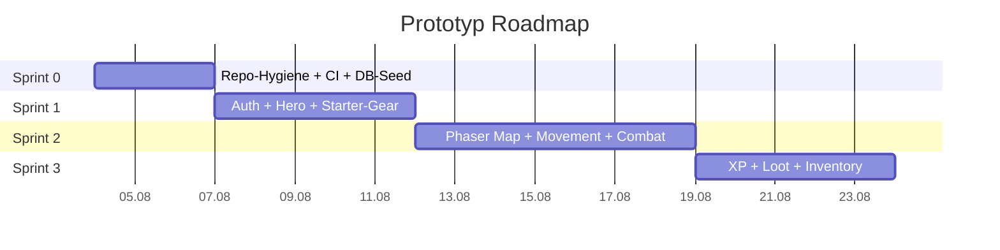

# Prototype Roadmap

**Stand:** 3. August 2026  
**Bezug:** [20-prototyp-checkliste.md](../architecture/20-prototyp-checkliste.md), [16-developer-guide.md](../architecture/16-developer-guide.md)

---

## Übersicht

4 Mini-Sprints vom leeren Repo zum spielbaren Prototypen.  
Jeder Sprint endet mit einem Demo-Schritt aus [Doc 20](../architecture/20-prototyp-checkliste.md).

---

## Sprint 0 – Fundament (3 Tage)

**Ziel:** Repo ist sauber, CI läuft, DB-Schema + Seed funktionieren.

| Ticket | Was | Done wenn |
|--------|-----|-----------|
| P0-1 | Monorepo + Lint + TS-Strict prüfen | `npm run build` grün |
| P0-2 | Docker Compose: Postgres + Redis | `npm run db:up` startet beide |
| P0-3 | DB-Schema als Migration anlegen (Drizzle/Prisma) | `npm run db:migrate` läuft |
| P0-4 | Seed-Script: `game-config.json` → `item_templates` + `chests` | `npm run db:seed` befüllt DB |
| P0-5 | `.env.example` dokumentiert, API `GET /health` | Health-Endpoint erreichbar |
| P0-6 | CI-Workflow läuft auf `main` | GitHub Actions grün |

**Demo:** `docker compose up` + `npm run dev:api` → `/health` → 200

---

## Sprint 1 – Auth + Held (5 Tage)

**Ziel:** Spieler kann sich mit Google einloggen, Helden erstellen, Starter-Gear sehen.

| Ticket | Was | Done wenn |
|--------|-----|-----------|
| P1-1 | Google OAuth: Login + Callback + JWT-Cookie | Login → Session gesetzt |
| P1-2 | `GET /me` geschützt | Returns userId |
| P1-3 | `POST /auth/logout` | Session gelöscht |
| P1-4 | `POST /hero` (Name + Klasse, Validierung, Starter-Items) | Held in DB, 2 Items im Inventar |
| P1-5 | `GET /hero` + `GET /inventory` | API liefert Held + Items |
| P1-6 | React: Login-Page → Hero-Creation → Inventar-Screen | Flow durchklickbar |
| P2-1 | Mock-Wallet: `ensure` pro User | `GET /wallet` liefert Adresse |

**Demo:** Login → Held "Testheld" + Nahkämpfer → Inventar zeigt Starter-Rüstung + Schwert

---

## Sprint 2 – Map + Combat (7 Tage)

**Ziel:** Spieler läuft auf der Map, kämpft gegen Bruiser, stirbt/respawnt.

| Ticket | Was | Done wenn |
|--------|-----|-----------|
| P4-1 | React-Page mit Phaser-Container + gameBridge | Phaser startet in React |
| P4-2 | BootScene: Placeholder-Assets laden | Scene lädt ohne Fehler |
| P4-3 | MatchScene: Map (Tilemap) + Spawn-Punkt | Map sichtbar |
| P4-4 | Spieler-Sprite: WASD + Mauszielen | Held steuerbar |
| P5-1 | Basisangriff (LMB) je Klasse | Angriff ausführbar |
| P5-2 | RuleEngine Stub: `basic_attack` + `enemy_melee` | Damage berechnet |
| P5-3 | Bruiser: idle → chase → attack (FSM) | Gegner verfolgt und greift an |
| P5-4 | Spieler-HP + Enemy-HP | Schaden sichtbar |
| P5-5 | Tod: HP ≤ 0 → 3s → Respawn | Spieler respawnt am Spawn |
| P5-6 | HUD: HP-Bar, Resource-Bar (React via gameBridge) | HUD aktualisiert live |

**Demo:** Abenteuer → laufen → Bruiser aggro → töten → sterben → respawn

---

## Sprint 3 – XP + Loot + Inventory (5 Tage)

**Ziel:** Kills geben XP, Level-Up, Kisten geben Loot, Items anlegbar.

| Ticket | Was | Done wenn |
|--------|-----|-----------|
| P6-1 | Enemy-Tod → XP (API-Persistenz) | XP in DB gespeichert |
| P6-2 | Level-Up bei Schwelle (aus game-config.json) | Level steigt, bleibt nach Reload |
| P6-3 | HUD: Level + XP-Bar | Anzeige aktualisiert |
| P7-1 | Kiste auf Map: Nähe + Taste E | Interaktion möglich |
| P7-2 | `POST /chests/:id/open` → weighted Loot-Roll | Item in DB + Inventar |
| P7-3 | `POST /inventory/:id/equip` → Stats aktualisieren | Ausrüsten ändert Werte |
| P7-4 | Loadout wirkt auf Held-Stats im nächsten Kampf | Ausgerüstetes Item = spürbarer Effekt |
| P7-5 | Inventar-UI: Items mit Rarity-Border | Seltenheit sichtbar |

**Demo:** Töten → XP steigt → Level-Up → Kiste öffnen → neues Item → anlegen → spürbar stärker → Reload: Level + Inventar noch da

---

## Nach dem Prototyp (nicht in dieser Roadmap)

- Echter MPC / Immutable Mint (M7)
- Activate/Deactivate Stake (M8)
- Colyseus Hub Multiplayer (M9)
- Claim to Self-Custody (M10)
- Fiat-Payments / Stripe
- Alle Skills + alle 3 Enemy-Typen poliert
- Tiled-Endcontent / Art-Pass

Siehe: [16-developer-guide.md](../architecture/16-developer-guide.md) – M0–M10

---

## Parallelisierung

Wenn mehrere Entwickler arbeiten:

| Track A – Platform | Track B – Game | Track C – Realtime |
|--------------------|---------------|---------------------|
| Sprint 0 (DB + CI) | Sprint 0 (Phaser Setup) | — |
| Sprint 1 (Auth + Hero) | Sprint 2 (Map + Combat) | — |
| Sprint 3 (Loot + Inventory) | Sprint 3 (Gameplay Polish) | — |
| Später: M7+ | Später: Content | Später: M9 Hub |
